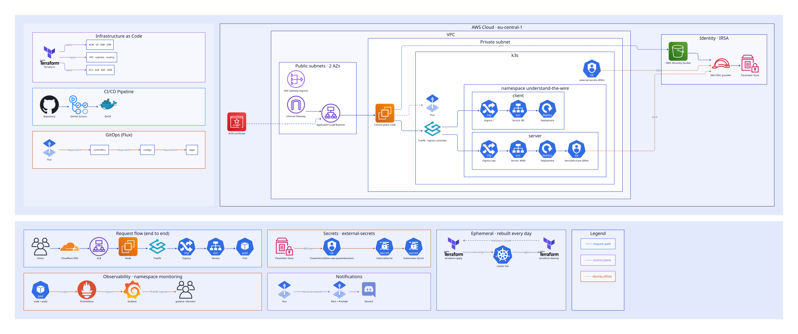

# Understand the Wire

- Website: https://www.understand-the-wire.com

_(The website is fully ephemeral - it is destroyed every night and rebuilt from scratch every morning)_

Understand the Wire is a DevOps portfolio project meant to showcase a fully self-hosted AWS + Kubernetes stack with CI/CD, managed completely in Terraform, and built with **best practices**, **scalability** and **multi-environment** in mind.

This is not just another project stacked up by tutorials. This is **production ready** configuration, based on my work experience and personal research, trial and error.

This project is **fully ephemeral** - it is destroyed every night and rebuilt from scratch every morning - ALB, Networking, NAT, DNS certificates and validation, self-hosted OIDC provider and much more - completely automatic. **This whole repository is the source of truth.** 

<p align="center">
  
</p>

## Understand the Wire features:

- **Fully Ephemeral:** Infrastructure is fully declared using Terraform. From the simple instances and network provisioning, all the way to DNS validation cross platform with Cloudflare.

- **Configured for Scale:** All of the configurations and directories were structured for multi-environment development. It is modular and uses variable substitution in Flux to support consistent development, staging and production environments. 

- **"Glass Box" Website:** The website is designed to complement and showcase the infrastructure it is hosted on. It shows real-time data about the Pods and Nodes that are serving your request, as well as the running workloads and some infrastructure data.

- **Not Just What, but Why:** My reasonings for choosing the components, problems I faced along with how I solved them, balancing cost vs operational overhead, advantages and tradeoffs - you understand the wire.

## Repository Structure

The repository is structured as one monorepo so you can see everything in one place.

In your projects you can structure it with the Kubernetes and Infrastructure configurations in a separate repository, and each service in a different repo if you prefer a monorepo architecture or plan to have many microservices. 

The directories go as follows:

- `infrastructure/` - Terraform configurations for everything. It contains a `modules` directory with the resources themselves, `bootstrap/` for the backend bucket and budget alerts (things that should not be destroyed, must be applied first), and lastly `envs/*` to add different environments with different base configurations.

- `k8s/` - Kubernetes manifests for the services, cluster configurations and Helm Charts. The `clusters` directory is used to add different environments using variable substitution.

- `services/` - Source code for the React client and FastAPI backend. Each service directory contains a Dockerfile and is targeted for changes by CI workflows.

- `.github/` - Workflows to build services and push them to the registry.

- `docs/` - Helpful documents and diagrams.

## Usage

Feel free to look at the website and the repo structure and content, you can also check out `docs/problems-solutions.md` for unexpected problems I encountered along the way.

Anyways, if you want to deploy it yourself, you need the following prerequisites (developed on Ubuntu Linux):

#### Accounts
1. AWS Account
2. Cloudflare account with a registered domain

#### Repository
1. Clone the repository (`git clone https://github.com/Alonkopilov/understand-the-wire.git`)
2. Upload the repo contents to _your_ repository for Flux to point at 

#### Tokens and Keys
1. Github Token for Flux and another one for GHCR access
2. Cloudflare Zone ID
3. Cloudflare API Token
4. Discord Channel Webhook for Alerts (optional)
5. AWS credentials (SSO user) 

#### Bootstrap files
1. Add your Terraform backend S3 bucket name at `infrastructure/bootstrap/buckets.tf`
2. Create an `.auto.tfvars` file (`cp .auto.tfvars.example .auto.tfvars`) in `infrastructure/envs/prod` and fill it up with the values from the _"Tokens and Keys"_ section
3. Create an `.auto.tfvars` file (`cp .auto.tfvars.example .auto.tfvars`) in `infrastructure/bootstrap` and add the email address to send budget alerts to.
4. Add your backend bucket name at `infrastructure/envs/prod/backend.tf`
5. Change the profile in `backend.tf`, `bootstrap/main.tf` and `infrastructure/envs/prod/.auto.tfvars` to match your SSO profile

#### Installations

1. AWS CLI 
```
$ curl "https://awscli.amazonaws.com/awscli-exe-linux-x86_64.zip" -o "awscliv2.zip"
$ unzip awscliv2.zip && sudo ./aws/install
$ rm -rf awscliv2.zip aws
```

2. Configure access
```
$ aws configure sso
```

3. Terraform CLI
```
$ sudo apt-get update && sudo apt-get install -y gnupg software-properties-common

$ wget -O- https://apt.releases.hashicorp.com/gpg | \
gpg --dearmor | \
sudo tee /usr/share/keyrings/hashicorp-archive-keyring.gpg > /dev/null

$ gpg --no-default-keyring \
--keyring /usr/share/keyrings/hashicorp-archive-keyring.gpg \
--fingerprint

$ echo "deb [arch=$(dpkg --print-architecture) signed-by=/usr/share/keyrings/hashicorp-archive-keyring.gpg] https://apt.releases.hashicorp.com $(grep -oP '(?<=UBUNTU_CODENAME=).*' /etc/os-release || lsb_release -cs) main" | sudo tee /etc/apt/sources.list.d/hashicorp.list

$ sudo apt update && sudo apt-get install terraform && terraform -install-autocomplete
```

4. SSM plugin (remote sessions)
```
$ curl "https://s3.amazonaws.com/session-manager-downloads/plugin/latest/ubuntu_64bit/session-manager-plugin.deb" \
  -o session-manager-plugin.deb
$ sudo dpkg -i session-manager-plugin.deb
$ rm session-manager-plugin.deb
```

#### Initialize Terraform and Apply (Caution: Starts billing!)
_The following commands will prompt you whether to create the infrastructure or not, make sure you understand everything that will be provisioned before blindly typing 'yes', because billing will start from this point onwards._
```
$ cd infrastructure/bootstrap && terraform init && terraform apply
$ cd ../envs/prod && terraform init && terraform apply
```

_Tear down the whole infrastructure with the following command (will stop billing)_
```
$ terraform destroy
```

## Author

Creator: [Alon Kopilov](https://github.com/Alonkopilov)<br/>
Feel free to contact me for questions or feedback at alon@kopilov.me